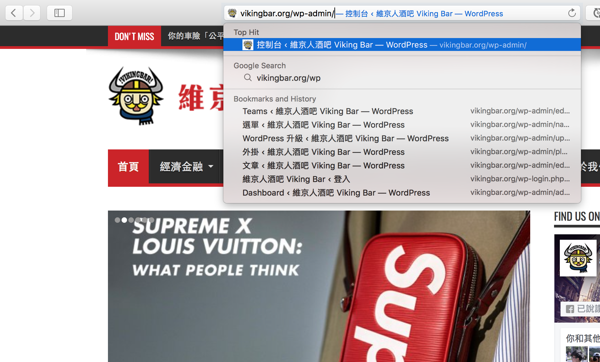
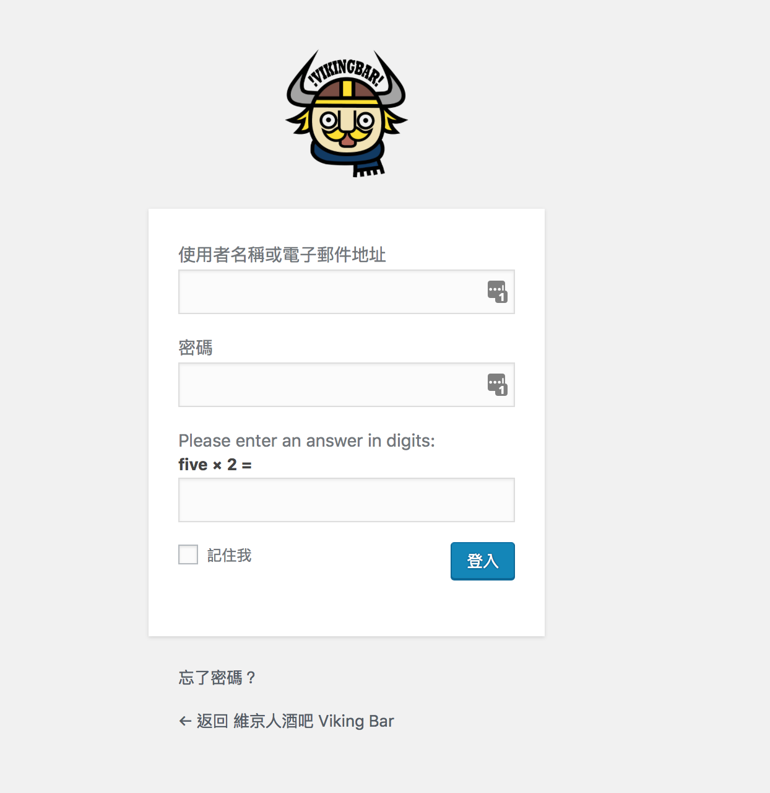
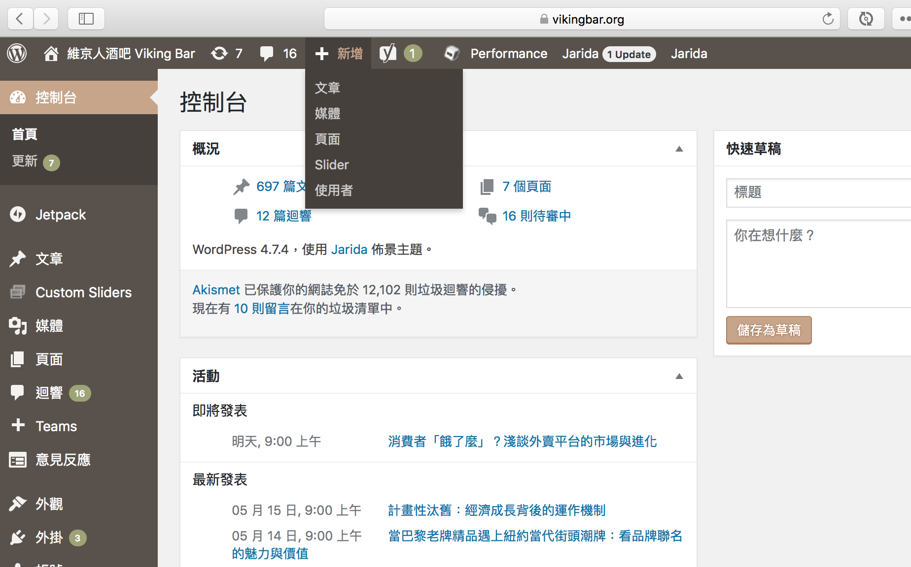

# Vikingbar 發文教學

## 1. 登入維京人後台

首先，在網址列輸入 [vikingbar.org/wp-admin/](http://vikingbar.org/wp-admin/)

接著，輸入帳號密碼，以及登入驗證，再按登入鍵進入後台

若沒有帳號密碼者，請向附近的IT大大求助

## 2. 進入後台，開始新增文章

進入後台後，請在網頁最上方的列表找到「+ 新增」的按鈕，滑鼠停在上面便會出現新增列表，點選「文章」，即可開始撰寫文章。